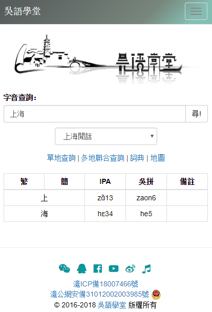
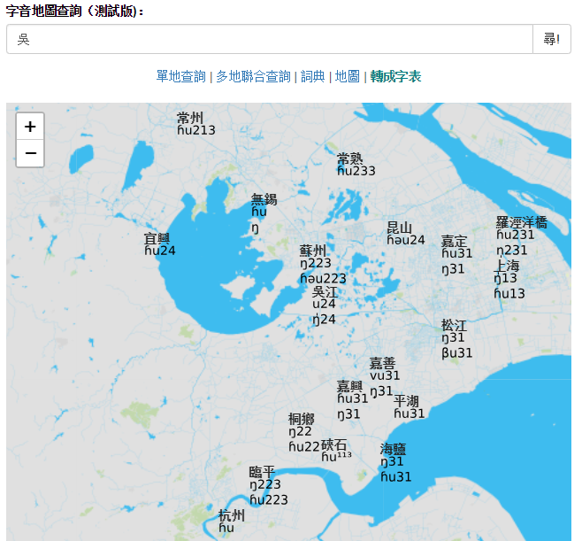

# �钦Z�W堂

[�钦Z�W堂](https://wugniu.com)是一��面向�V泛受��、含有�S富及有益�热莸��钦Z�W��教育�W站。包括�钦Z�^各地方言字音、�~�〉拿赓M在���钦Z�~典。供母�Z者或非母�Z者查��字音，自我�m�e使用。�橥��V�钦Z正字正音，促�M�钦Z��面文字����化服�眨�提高大���ψ约耗刚Z功能的�J�R。介�B�钦Z文化和�Z言，�樵��钦Z�W��、研究方面有�d趣的人提供�椭��c服�眨��K探���钦Z文字使用是����和���剩�鼓�畲蠹胰���作�钦Z�Z文作品，���钦Z��面化�F代化努力。

  

  

## Built With

* [Node.js](https://nodejs.org/en/) - Back-end language
* [Express](https://expressjs.com/) - Web framework
* [SQLite3](https://github.com/mapbox/node-sqlite3) - Database
* [阿里云](https://cn.aliyun.com/) - Web hosting service
* [PM2](https://github.com/Unitech/pm2) - Process manager
* [Bootstrap](https://getbootstrap.com/docs/3.3/) - Front-end library
* [Font Awesome](https://fontawesome.com/) - Icon Toolkit
* [Leaflet](https://leafletjs.com/) - Interactive map library
* [jQuery](https://jquery.com/) - DOM manipulation library

## Author

* [Federico Demarco](https://github.com/fededem)

## Acknowledgments

* Server Manager - [eve](https://github.com/woq)
